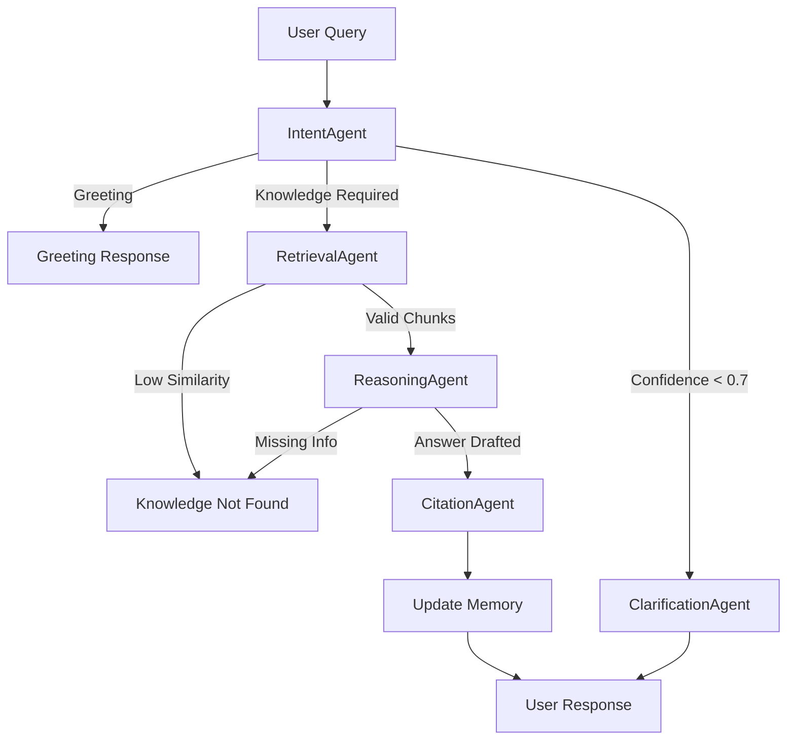

# 05 Decision and Routing Rules

## 1. Overview
The orchestrator in the Agentic Trainer acts as a finite state machine (managed by LangGraph). This document outlines the logical rules, conditions, and thresholds that determine how a user's query moves through the system.

## 2. Routing Logic

### 2.1 Initial Routing
When a new user message arrives:
1. Extract the current state (conversation history).
2. Pass the message to the **Intent Agent**.
3. Based on the Intent Agent's output:
   - If `intent == 'GREETING'`, route to a simple deterministic response handler.
   - If `intent == 'HOW_TO'` or `'DEBUG'` or `'DEFINITION'`, route to **Retrieval Agent**.
   - If `intent == 'UNCLEAR'` or `confidence_score < 0.7`, route to **Clarification Agent**.

### 2.2 Retrieval Phase Routing
After the Retrieval Agent queries ChromaDB:
1. Examine the retrieved context chunks.
2. If `len(chunks) == 0` or the top similarity score is below `0.65` (configurable threshold):
   - Route to **Fallback logic** (inform the user that the knowledge base does not contain the answer).
3. If valid chunks are found:
   - Route to **Reasoning Agent**.

### 2.3 Reasoning Phase Routing
After the Reasoning Agent generates a draft:
1. Examine the draft's output flags.
2. If the Reasoning Agent states it cannot answer based *strictly* on the context (e.g., hallucination prevention triggered):
   - Route to **Clarification Agent** or Fallback.
3. If a valid answer is generated:
   - Route to **Citation Agent**.

### 2.4 Citation and Output
After the Citation Agent formats the response:
1. Update the **Memory Agent** with the final Q&A pair.
2. Return the response to the user.
3. Terminate workflow.

## 3. Confidence Thresholds
- **Intent Confidence:** Minimum `0.70`. Below this, the system asks the user to rephrase.
- **Retrieval Similarity:** Minimum `0.65` cosine similarity. Below this, chunks are considered irrelevant and discarded.

## 4. Fallback and Escalation
- **Fallback:** If the system cannot answer, it must gracefully fail: *"I apologize, but I couldn't find information regarding [Topic] in my knowledge base. Would you like me to notify an administrator to add this documentation?"*
- **Retry Rules:** If an agent API call fails (e.g., local LLM timeout), the system will retry up to 3 times with exponential backoff.
- **Escalation:** If a user flags an answer as incorrect 3 times in a row, the conversation is marked for human review.

## 5. Agent Sequencing (Branching Logic)

